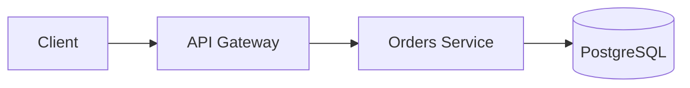

# 📝 Writing & Publishing Docs in This Repo

This file tells you everything you need to know to write documentation in this
repo and have it automatically published to
**[docs.stellarglobalsupplies.com](https://docs.stellarglobalsupplies.com)**.

> **TL;DR:** Write a `.md` file in the right `docs/` subfolder → merge to `main`
> → your page is live on the docs site within ~2 minutes. That's it.

---

## Folder structure — where to put your doc

```
docs/
├── architecture/   ← System design, data flows, component maps
├── runbooks/       ← Ops procedures, incident response, on-call guides
├── infra/          ← Terraform modules, deployment steps, environments
├── api/            ← Endpoint docs, auth, request/response examples
├── adr/            ← Architecture Decision Records
├── images/         ← Images referenced by any doc above
└── templates/      ← Copy-paste starter files (do not publish these)
```

**Pick the right folder. One doc, one folder. No exceptions.**

| I'm documenting... | Put it in |
|--------------------|-----------|
| How the system is designed | `docs/architecture/` |
| How to respond to an incident or perform a procedure | `docs/runbooks/` |
| What Terraform modules exist and how to use them | `docs/infra/` |
| API endpoints, request/response shapes, auth | `docs/api/` |
| A technical decision we made and why | `docs/adr/` |

---

## Step-by-step: creating a new doc

### Step 1 — Pick a template

Every doc type has a ready-made template. **Always start from a template.**

```bash
# From the repo root:

# Architecture doc
cp docs/templates/architecture.md docs/architecture/my-service-architecture.md

# Runbook
cp docs/templates/runbook.md docs/runbooks/my-service-incident.md

# Infra doc
cp docs/templates/infra.md docs/infra/my-module.md

# API doc
cp docs/templates/api.md docs/api/my-service-api.md

# ADR
cp docs/templates/adr.md docs/adr/adr-NNN-short-title.md
```

### Step 2 — Name the file correctly

Use `kebab-case`. Be descriptive.

```
✅  rds-failover-runbook.md
✅  orders-service-architecture.md
✅  adr-004-redis-vs-elasticache.md

❌  Runbook.md
❌  doc1.md
❌  My New File.md
```

### Step 3 — Fill in the frontmatter (top of the file)

The first 4 lines of every file **must** be:

```markdown
---
title: "Your Page Title Here"
description: "One sentence that describes what this page covers"
---
```

This becomes the page title and description on the docs site.
If you skip this, the pipeline uses the filename as the title — which looks bad.

### Step 4 — Write your content

Use standard Markdown. Everything supported:

```markdown
## Headings (H2 and below — H1 is reserved for the title)

**bold**, _italic_, `inline code`

| Table | Header |
|-------|--------|
| cell  | cell   |

- Bullet lists
1. Numbered lists

> Blockquotes for callouts

```bash
# Code blocks with language hints
aws ecs list-services --cluster stellar-production
```


```

**Mintlify also renders these components** (use them in `.md` files):

```markdown
<Note>This is an informational callout.</Note>

<Warning>This warns about something important.</Warning>

<Tip>This is a helpful tip.</Tip>

<Info>Neutral information callout.</Info>
```

### Step 5 — Add images (optional)

Store all images in `docs/images/`. Reference with relative paths:

```markdown

```

Supported formats: `.png`, `.jpg`, `.svg`, `.gif`

For architecture diagrams, prefer **Mermaid** (renders natively, no image file needed):

````markdown

````

### Step 6 — Commit and push

```bash
git checkout -b docs/add-orders-runbook

git add docs/
git commit -m "docs: add orders service incident runbook"

git push origin docs/add-orders-runbook
```

Open a PR, get it reviewed, merge to `main`.

**The pipeline runs automatically on merge. No manual deploy step.**

---

## What happens after you merge

```
Your PR merges to main
        │
        ▼  (~30 seconds)
push-docs.yml GitHub Action runs
        │
        ├── Finds all changed .md files under docs/
        ├── Converts them to .mdx with correct frontmatter
        ├── Copies them to stellar-docs repo (under docs/<this-repo-name>/)
        └── Commits and pushes to stellar-docs/main
                │
                ▼  (~60 seconds)
        Mintlify GitHub App detects push to stellar-docs
                │
                ▼
        docs.stellarglobalsupplies.com updates ✅
```

Total time from merge → live on docs site: **~2 minutes**

---

## Updating an existing doc

Just edit the file and merge to `main`. The pipeline does a create-or-update —
it overwrites the existing page on the docs site with the new content.

```bash
git checkout -b docs/update-rds-runbook
# edit docs/runbooks/rds-failover-runbook.md
git add docs/runbooks/rds-failover-runbook.md
git commit -m "docs: update RDS failover runbook with new endpoint"
git push origin docs/update-rds-runbook
# open PR → merge
```

---

## Deleting a doc

Deleting a file from `docs/` in this repo will also remove it from the docs site.

```bash
git rm docs/runbooks/old-runbook.md
git commit -m "docs: remove deprecated old-runbook"
git push origin main  # via PR
```

> ⚠️ For ADRs — never delete them. If a decision is superseded, update its
> `Status` field to `Superseded by ADR-[NNN]` and add a link to the new ADR.

---

## Where your docs appear on the site

Your docs are published under a path based on this repo's `REPO_SECTION` secret:

```
docs.stellarglobalsupplies.com/<repo-section>/<subfolder>/<filename>
```

For example, if `REPO_SECTION=payments-api`:

| File in this repo | URL on docs site |
|-------------------|-----------------|
| `docs/architecture/payments-architecture.md` | `.../payments-api/architecture/payments-architecture` |
| `docs/runbooks/card-decline-runbook.md` | `.../payments-api/runbooks/card-decline-runbook` |
| `docs/adr/adr-001-stripe-vs-adyen.md` | `.../payments-api/adr/adr-001-stripe-vs-adyen` |

The sidebar navigation updates automatically — you do not need to touch `docs.json`
in `stellar-docs`.

---

## Checklist before you open a PR

- [ ] File is in the correct subfolder (`architecture/`, `runbooks/`, `infra/`, `api/`, `adr/`)
- [ ] Filename is `kebab-case` with `.md` extension
- [ ] File starts with valid frontmatter (`---`, `title`, `description`, `---`)
- [ ] No broken image links (images exist in `docs/images/`)
- [ ] No placeholder text left from the template (search for `[` and `TODO`)
- [ ] Reviewed locally with `mintlify dev` if you want to preview (optional)

---

## Local preview (optional)

To see exactly what your doc looks like before merging:

```bash
# One-time install
npm i -g mintlify

# Clone the docs repo
git clone git@github.com:stellarglobalsupplies/stellar-docs.git
cd stellar-docs

# Start local preview
mintlify dev
# Opens at http://localhost:3000
```

---

## Common mistakes

| Mistake | What happens | Fix |
|---------|-------------|-----|
| Missing frontmatter | Title shows as raw filename | Add `---\ntitle: "..."\ndescription: "..."\n---` at top |
| File outside `docs/` | Pipeline ignores it | Move to correct `docs/` subfolder |
| Uppercase or spaces in filename | Works but looks bad in URLs | Rename to `kebab-case.md` |
| Image not in `docs/images/` | Broken image on docs site | Move image to `docs/images/`, update path |
| Editing `stellar-docs` directly | Gets overwritten on next pipeline run | Always edit in the source repo |
| Deleting an ADR | History lost | Set status to `Superseded` instead |

---

## Questions?

- Slack: `#eng-docs`
- Docs site: [docs.stellarglobalsupplies.com](https://docs.stellarglobalsupplies.com)
- Stellar-docs repo: `stellarglobalsupplies/stellar-docs`
- This pipeline: `.github/workflows/push-docs.yml` in this repo
