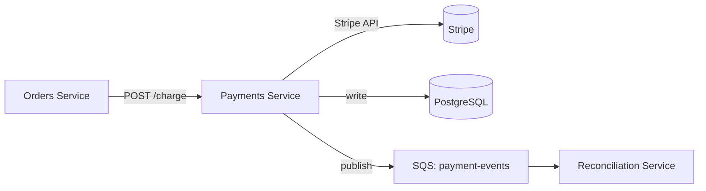

> This is an **example** of a filled-in architecture doc.
> Copy `docs/templates/architecture.md` and fill it in like this.
> Delete this callout when you write your real doc.

## Overview

The Payments Service handles all money movement for Stellar Global Supplies —
card charges, refunds, and payout reconciliation. It sits between the Orders
Service and the Stripe API, providing an internal abstraction that decouples
business logic from payment provider specifics.

**Owner:** `@team-payments`
**Last reviewed:** `2025-07-01`
**Status:** `Approved`

---

## System Context

---

## Components

### Payments API

- **What it is:** REST API that accepts charge and refund requests from internal services
- **Technology:** Python 3.12, FastAPI
- **Deployed as:** ECS Fargate, 2 tasks min
- **Scales:** Horizontally — autoscales to 8 tasks at CPU > 70%
- **Repo:** `stellarglobalsupplies/stellar-payments-api`

### Reconciliation Worker

- **What it is:** Async consumer that matches Stripe webhooks against internal records
- **Technology:** Python 3.12, Celery + SQS
- **Deployed as:** ECS Fargate, 1 task (single consumer by design)
- **Scales:** Fixed — single consumer ensures ordering
- **Repo:** `stellarglobalsupplies/stellar-payments-api`

---

## Data Flow

1. Orders Service calls `POST /v1/charges` with order ID and amount
2. Payments Service validates the request and idempotency key
3. Stripe charge is created via Stripe API
4. Result is persisted to PostgreSQL with Stripe's charge ID
5. A `payment.charged` event is published to the `payment-events` SQS queue
6. `201` with the internal payment record is returned to Orders Service
7. Async: Stripe webhook fires → Reconciliation Worker updates the record status

---

## Infrastructure

| Resource | Type | Region | Notes |
|----------|------|--------|-------|
| `stellar-payments-db` | RDS PostgreSQL 15 | `ap-south-1` | Multi-AZ, encrypted |
| `stellar-payments-svc` | ECS Fargate | `ap-south-1` | 2–8 tasks, autoscale |
| `payment-events` | SQS Standard | `ap-south-1` | DLQ after 3 retries |
| Stripe API keys | Secrets Manager | `ap-south-1` | Rotated every 90 days |

---

## Security

- **Authentication:** mTLS between Orders Service and Payments Service (internal only)
- **Secrets:** Stripe API keys in AWS Secrets Manager, never in env vars or code
- **PCI scope:** This service is in scope for PCI DSS — no card numbers are stored
- **Network:** Private subnet only, no public IP, VPC endpoint to Secrets Manager

---

## Related Documents

- [Runbook: Payment charge failure](../runbooks/payment-charge-failure.md)
- [Runbook: Stripe webhook backlog](../runbooks/stripe-webhook-backlog.md)
- [Infra: Payments ECS module](../infra/payments-ecs.md)
- [ADR-005: Why we chose Stripe over Adyen](../adr/adr-005-stripe-vs-adyen.md)
- [API: Payments API reference](../api/payments-api.md)
