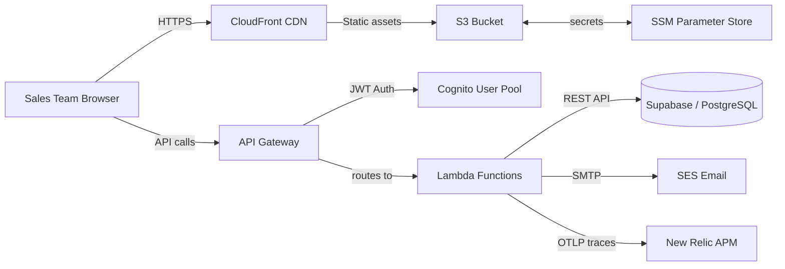

## Overview

The SGS Quote App is a serverless web application that enables sales teams at Stellar Global Supplies to create, manage, and email professional GST-compliant quotes to customers. It provides a dashboard for quote lifecycle management (draft → sent → accepted/rejected) with automatic quote numbering and PDF generation.

**Owner:** `@team-sgs-quote`
**Author:** `Prasad Bhavsar`
**Last reviewed:** `2025-07-26`
**Status:** `Approved`

---

## System Context



---

## Components

### Frontend (React SPA)

- **What it is:** Single-page application for quote creation, customer management, and quote lifecycle
- **Technology:** TypeScript, React 18, Vite, Tailwind CSS
- **Deployed as:** Static files on S3 + CloudFront CDN
- **Scales:** Horizontally via CDN — zero capacity management
- **Repo:** `stellarglobalsupplies/stellarglobalsupplies-quote`
- **Key features:**
  - Quote editor with real-time tax calculations (IGST/CGST/SGST)
  - Customer management with GST-based deduplication
  - PDF generation client-side using jsPDF
  - Email integration with PDF attachment
  - Dark mode UI
  - Mobile-responsive design

### Backend (Lambda Functions)

- **What it is:** REST API handling quote CRUD, customer management, SKU search, and email dispatch
- **Technology:** Python 3.12
- **Deployed as:** AWS Lambda (7 functions), API Gateway HTTP API
- **Scales:** Horizontally per-invocation — Lambda handles concurrency
- **Repo:** `stellarglobalsupplies/stellarglobalsupplies-quote`
- **Key design decisions:**
  - Each endpoint mapped to a dedicated Lambda function for isolation
  - OpenTelemetry tracing integrated via OTLP for observability
  - Service role key for Supabase authentication
  - Environment-specific configuration via SSM Parameter Store

### Database (Supabase)

- **What it is:** PostgreSQL database for quotes, customers, and SKU data
- **Technology:** Supabase (managed PostgreSQL 15)
- **Deployed as:** Managed SaaS with RLS and auto-backups
- **Scales:** Vertically — plan upgrade when needed
- **Repo:** Schema in `infrastructure/supabase_schema.sql`
- **Database tables:**
  - `quote_customers` — Customer records with GST-based deduplication
  - `quotes` — Quote records with items stored as JSONB
  - `skus` — Product SKU catalog with HSN/SAC codes

---

## Data Flow — Create Quote

1. Sales team member fills in customer details and quote items in the React frontend
2. Frontend sends `POST /api/quotes` with customer data and items as JSON
3. API Gateway validates the JWT from Cognito, routes to the `save_quote` Lambda
4. Lambda upserts the customer to `quote_customers` table — auto-deduplicates by GST number
5. Lambda assigns the next sequential quote number (`SGS/FY/seq`) for new quotes
6. Lambda upserts the quote with items, tax calculations, and grand total to `quotes` table
7. Response returns the saved quote with customer ID — frontend displays confirmation

---

## Data Flow — Send Quote Email

1. User clicks "Send Email" on a quote in the frontend
2. Frontend generates a PDF client-side and sends it as base64 to `POST /api/email/send`
3. Lambda sends the email via Amazon SES with the PDF attachment
4. Response returns the message ID — frontend shows success toast

---

## Infrastructure

| Resource | Type | Region | Notes |
|----------|------|--------|-------|
| `sgs-quote-frontend` | S3 Bucket | `us-east-1` | Static website hosting, versioned |
| `sgs-quote-cdn` | CloudFront | Global | Custom domain `quote.stellarglobalsupplies.com` |
| `sgs-quote-api` | API Gateway HTTP API | `us-east-1` | JWT authorizer, custom domain |
| `sgs-quote-app` | Lambda Functions (×7) | `us-east-1` | Python 3.12, 128MB–512MB |
| Supabase DB | PostgreSQL 15 | `us-east-1` (Supabase) | Managed, RLS enabled |
| SSM Parameters | Parameter Store | `us-east-1` | `/sgs-quote/*` prefix |
| Certificate | ACM | `us-east-1` | `*.stellarglobalsupplies.com` |

### Infrastructure Diagram

```
┌─────────────────────────────────────────────────────────────┐
│                      AWS Cloud (us-east-1)                   │
│                                                             │
│  ┌─────────────┐    ┌──────────────┐    ┌───────────────┐  │
│  │   Browser    │───▶│  CloudFront  │───▶│  S3 Frontend  │  │
│  └─────────────┘    └──────────────┘    └───────────────┘  │
│        │                                                     │
│        ▼                                                     │
│  ┌──────────────────────────────────────────────────┐       │
│  │              API Gateway HTTP API                  │       │
│  │         JWT Authorizer (Cognito)                  │       │
│  └───────────┬──────────┬──────────┬───────────────┘       │
│              │          │          │                         │
│       ┌──────▼──┐ ┌─────▼────┐ ┌──▼────────┐               │
│       │ save_   │ │ get_     │ │ send_     │               │
│       │ quote   │ │ quotes   │ │ email     │  ... (7 fns) │
│       └──────┬──┘ └─────┬────┘ └──┬────────┘               │
│              │          │          │                         │
│              └──────────┼──────────┘                         │
│                         │                                    │
│              ┌──────────▼──────────┐                        │
│              │     Supabase DB      │                        │
│              │  (PostgreSQL 15)     │                        │
│              └─────────────────────┘                        │
└─────────────────────────────────────────────────────────────┘
```

---

## Lambda Functions

| Function | Endpoint | Purpose | Memory | Timeout |
|----------|----------|---------|--------|---------|
| `save_quote` | `POST /api/quotes` | Create/update quotes | 256MB | 30s |
| `get_quotes` | `GET /api/quotes` | List/search quotes | 256MB | 30s |
| `delete_quote` | `DELETE /api/quotes/{id}` | Delete a quote | 128MB | 10s |
| `save_customer` | `POST /api/customers` | Create/update customers | 128MB | 10s |
| `get_customers` | `GET /api/customers` | List/search customers | 128MB | 10s |
| `get_skus` | `GET /api/skus` | Search SKUs/products | 128MB | 10s |
| `send_email` | `POST /api/email/send` | Send quote via SES | 512MB | 60s |

### Lambda Dependencies

All Lambda functions share common modules:
- `supabase_client.py` — Supabase REST API client with tracing
- `tracing.py` — OpenTelemetry configuration and decorators
- AWS SDK via Lambda runtime (boto3)

---

## Security

- **Authentication:** JWT tokens issued by Cognito User Pool
- **Authorization:** API Gateway JWT authorizer — validates tokens before Lambda invocation
- **Database access:** Supabase service role key stored in SSM Parameter Store (SecureString)
- **Network:** Lambda runs in VPC with no public IP; API Gateway is the public entry point
- **Encryption:** TLS 1.2+ in transit (CloudFront + API Gateway), AES-256 at rest (RDS, S3)
- **Secrets:** All secrets in SSM Parameter Store with KMS encryption; never in code or env vars
- **PII handling:** Customer records contain PII — database RLS policies restrict access

---

## Tracing & Monitoring

- **Tracing:** OpenTelemetry SDK in Lambda → OTLP → New Relic APM (EU region)
- **Logging:** JSON structured logs via `TraceJsonFormatter` in CloudWatch Logs
- **Sampling:** 75% trace sampling (`parentbased_traceidratio`)
- **Dashboards:** [New Relic APM — sgs-quote-app](https://one.newrelic.com/redirect/entity/dashboard)
- **Alerts:** Error rate > 5%, P99 latency > 2s

### Key Metrics to Monitor

| Metric | Threshold | Action |
|--------|-----------|--------|
| Lambda Error Rate | > 5% | Investigate logs |
| P99 Duration (save_quote) | > 10s | Check Supabase latency |
| Email Send Success Rate | < 95% | Check SES reputation |
| Supabase Active Connections | > 160 (80% of 200) | Scale up or add pooling |

---

## Deployment

- **CI/CD:** GitHub Actions → Terraform apply → Lambda zip deploy
- **Deploy frequency:** On every merge to `main`
- **Frontend:** Build static assets → sync to S3 → invalidate CloudFront
- **Backend:** Install Python deps → zip Lambda code → Terraform updates function
- **Rollback:** Revert PR and redeploy, or use previous Lambda version

### Deploy Pipeline Steps

```
Git Push / PR Merge to main
        │
        ▼
GitHub Action: deploy.yml
        │
        ├── Install Python deps (pip install -t backend/lambda/)
        ├── Build frontend (npm run build)
        ├── Sync frontend to S3
        ├── Invalidate CloudFront cache
        ├── Zip Lambda code + deps
        └── Terraform apply (updates Lambda + infra)
```

---

## Cost Estimate

| Resource | Monthly Cost |
|----------|-------------|
| Lambda (7 functions, ~10K invocations) | ~$1 |
| API Gateway HTTP API | ~$3 |
| S3 + CloudFront | ~$5 |
| Cognito User Pool | ~$0 (free tier) |
| SSM Parameter Store | ~$1 |
| Supabase Pro Plan | ~$25 |
| **Total** | **~$35/month** |

---

## Related Documents

- [Runbook: Quote App High Error Rate](../runbooks/sgs-quote-app-high-error-rate.md)
- [Infra: SGS Quote App Infrastructure](../infra/sgs-quote-app-infra.md)
- [API: SGS Quote App API Reference](../api/sgs-quote-app-api.md)
- [ADR-001: Why we chose Supabase over self-hosted PostgreSQL](../adr/adr-001-supabase-vs-self-hosted.md)
- [ADR-002: Why we chose Lambda over ECS Fargate](../adr/adr-002-lambda-vs-ecs-fargate.md)
- [OTLP Lambda Tracing Guide](../architecture/otlp-lambda-tracing.md)