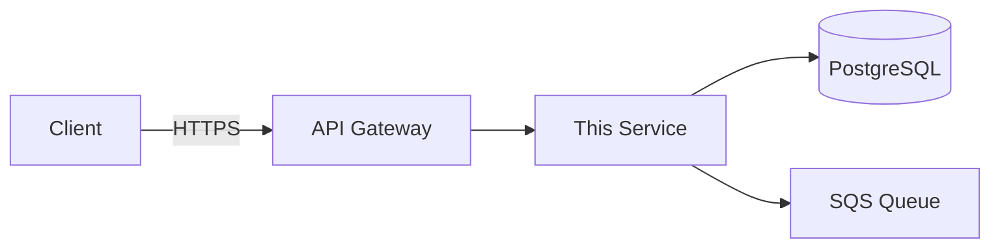

<!--
  TEMPLATE: Architecture Document
  ================================
  Copy this file to docs/architecture/<service-name>-architecture.md
  Fill in every section. Delete sections that don't apply.
  Remove all HTML comments before committing.
-->

## Overview

> One paragraph. What does this service do, who uses it, and why does it exist?
> Keep it to 3–5 sentences max.

**Owner:** `@team-name`
**Last reviewed:** `YYYY-MM-DD`
**Status:** `Draft` | `Review` | `Approved` | `Deprecated`

---

## System Context

> Where does this service sit in the wider platform?
> Who/what calls it? What does it call?

```
[External Client]
      │
      ▼ HTTPS
[API Gateway]
      │
      ▼
[This Service]  ──►  [PostgreSQL RDS]
      │
      ▼
[Downstream Service / Queue]
```

> Replace the ASCII diagram above with your actual flow.
> For complex diagrams, use a Mermaid block:



---

## Components

### [Component 1 Name]

- **What it is:** Brief description
- **Technology:** e.g. Node.js, Python, Go
- **Deployed as:** e.g. ECS Fargate task, Lambda, EC2
- **Scales:** Horizontally / Vertically / Fixed
- **Repo:** `stellarglobalsupplies/<repo-name>`

### [Component 2 Name]

- **What it is:**
- **Technology:**
- **Deployed as:**
- **Scales:**
- **Repo:**

---

## Data Flow

> Walk through the primary happy-path request from entry to exit.

1. Client sends `POST /api/v1/orders` with a JSON payload
2. API Gateway validates the JWT and routes to the Order Service
3. Order Service validates the request, writes to PostgreSQL
4. A message is published to the `orders-created` SQS queue
5. The Fulfillment Service consumes the queue and triggers downstream processing
6. Response `201 Created` is returned to the client

---

## Infrastructure

| Resource | Type | Region | Notes |
|----------|------|--------|-------|
| `stellar-orders-db` | RDS PostgreSQL 15 | `ap-south-1` | Multi-AZ, encrypted |
| `stellar-orders-svc` | ECS Fargate | `ap-south-1` | 2 tasks min, autoscale to 10 |
| `orders-created` | SQS FIFO | `ap-south-1` | DLQ enabled, 4 retries |
| `stellar-orders-api` | API Gateway v2 | `ap-south-1` | Custom domain via R53 |

---

## External Dependencies

| Dependency | Purpose | Owned by | Fallback if down |
|------------|---------|----------|-----------------|
| Stripe API | Payment processing | Stripe | Queue order, retry async |
| SendGrid | Email notifications | SendGrid | Log and retry for 24h |
| Auth0 | JWT validation | Auth0 | Cached JWKS, 5min grace |

---

## Security

- **Authentication:** JWT Bearer tokens validated via Auth0 JWKS endpoint
- **Authorisation:** Role-based — `admin`, `ops`, `readonly`
- **Secrets management:** AWS Secrets Manager, rotated every 90 days
- **Network:** Service runs in private subnet, no public IP
- **Encryption:** TLS 1.2+ in transit, AES-256 at rest (RDS + S3)
- **PII handling:** Order records contain PII — see [Data Classification Policy]

---

## Scalability & Performance

- **Expected load:** ~500 req/min peak
- **P99 latency target:** < 200ms
- **Autoscaling trigger:** CPU > 70% for 2 minutes
- **Database connection pool:** 10 min, 50 max per ECS task
- **Known bottlenecks:** Single-region RDS write path

---

## Failure Modes & Resilience

| Failure | Impact | Mitigation |
|---------|--------|-----------|
| RDS primary fails | Orders fail | Multi-AZ auto-failover ~30s |
| SQS consumer crashes | Fulfillment delayed | DLQ + alarm + auto-restart |
| Auth0 outage | All requests rejected | Cached JWKS with 5min TTL |
| ECS task OOM | Pod restart | Alert + autoscale adds capacity |

---

## Monitoring & Alerts

| Alert | Threshold | Action |
|-------|-----------|--------|
| Error rate > 5% | 5 min window | Page on-call |
| P99 latency > 500ms | 5 min window | Notify #eng-ops |
| RDS CPU > 80% | 10 min window | Notify #eng-ops |
| DLQ depth > 0 | Immediate | Page on-call |

**Dashboards:** [Link to CloudWatch / Datadog dashboard]
**Logs:** CloudWatch Log Group `/ecs/stellar-orders-svc`

---

## Deployment

- **CI/CD:** GitHub Actions → ECR → ECS rolling deploy
- **Deploy frequency:** On every merge to `main`
- **Rollback strategy:** ECS service roll back to previous task definition
- **Deploy time:** ~4 minutes end to end
- **Feature flags:** LaunchDarkly (see [Feature Flag Guide])

---

## Open Questions / Future Work

- [ ] Multi-region failover for DR — Q3 2025
- [ ] Read replica for reporting queries — backlog
- [ ] Move to Aurora Serverless v2 — under evaluation

---

## Related Documents

- [Runbook: Order Service Incident Response](../runbooks/order-service-incident.md)
- [ADR-001: Why we chose PostgreSQL over DynamoDB](../adr/adr-001-postgresql-vs-dynamodb.md)
- [Infra: ECS Terraform module](../infra/ecs-module.md)
